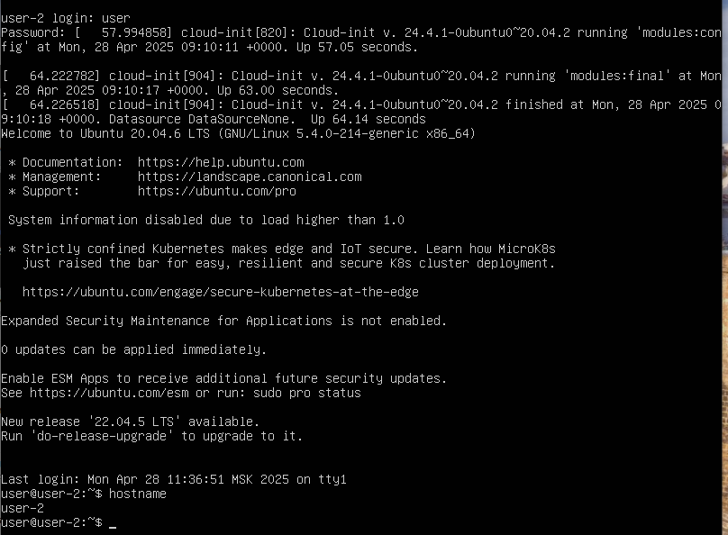
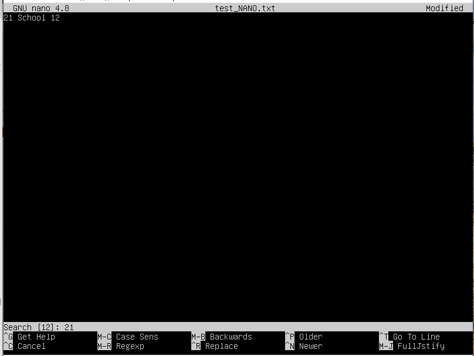
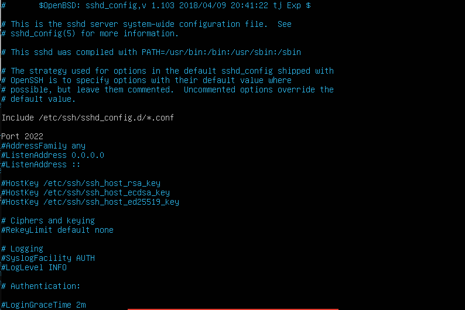
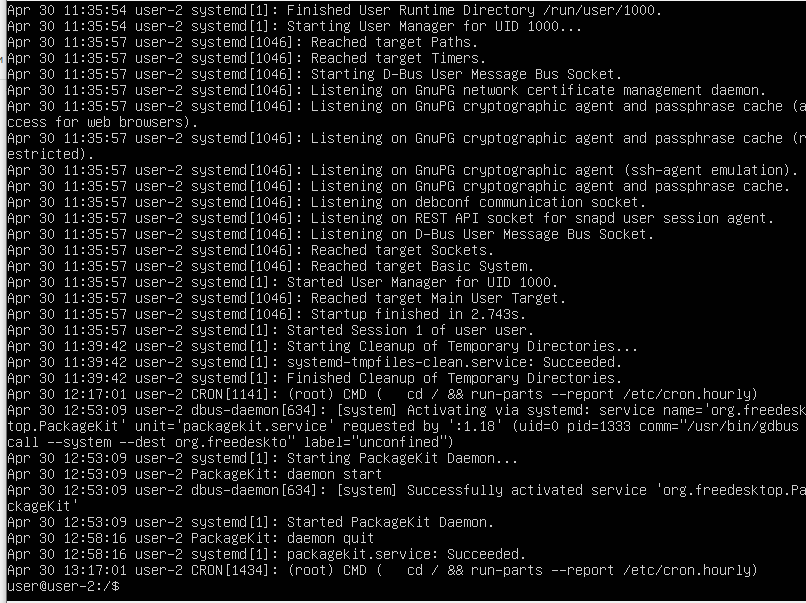
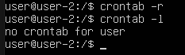

## Part 1. Установка ОС

== Задание ==

Установи Ubuntu 20.04 Server LTS без графического интерфейса. (Используем программу для виртуализации — VirtualBox)
Графический интерфейс должен отсутствовать.

Узнай версию Ubuntu, выполнив команду
cat /etc/issue

Вставь скриншот с выводом команды.

== Выполнение ==

- установлена  Ubuntu 20.04 Server LTS без графического интерфейса. в виртуальной машине VirtualBox, скаченная с [сайта](https://releases.ubuntu.com/20.04/)

## Part 2. Создание пользователя

== Задание ==

Создай пользователя, отличного от созданного при установке. Пользователь должен быть добавлен в группу adm.
Вставь скриншот вызова команды для создания пользователя.
Новый пользователь должен быть в выводе команды
cat /etc/passwd
Вставь скриншот с выводом команды.

== Выполнение ==

- команда для создания нового пользователя с именем sber: sudo adduser sber 

- команда для добавления нового пользоваетдя в группу adm: sudo usermod -a -G adm sber
- команда для проверки пользователя в группе groups

## Part 3. Настройка сети ОС

== Задание ==

Задай название машины вида user-1.
Установи временную зону, соответствующую твоему текущему местоположению.
Выведи названия сетевых интерфейсов с помощью консольной команды.
В отчёте дай объяснение наличию интерфейса lo.
Используя консольную команду, получи ip адрес устройства, на котором ты работаешь, от DHCP-сервера.
В отчёте дай расшифровку DHCP.
Определи и выведи на экран внешний ip-адрес шлюза (ip) и внутренний IP-адрес шлюза, он же ip-адрес по умолчанию (gw).
Задай статичные (заданные вручную, а не полученные от DHCP-сервера) настройки ip, gw, dns (используй публичный DNS-серверы, например 1.1.1.1 или 8.8.8.8).
Перезагрузи виртуальную машину. Убедись, что статичные сетевые настройки (ip, gw, dns) соответствуют заданным в предыдущем пункте.
В отчёте опиши, что сделал для выполнения всех семи пунктов (можно как текстом, так и скриншотами).
Успешно пропингуй удаленные хосты 1.1.1.1 и ya.ru и вставь в отчёт скрин с выводом команды. В выводе команды должна быть фраза «0% packet loss».

== Выполнение ==
- команда проверки названия машины hostname

- команда для названия машины sudo hostname user-1

- для сохранения имени машины запускаем команду sudo hostnamectl set-hostname user-1  и затем перезапускаем машину командой reboot

- команда date для проверки действующей временной зоны показала, что текущая зона отличается от текущего местоположения

- вводим команду sudo timedatectl set-timezone Europe/Moscow  и затем снова проверяем date

- для получения названия сетевых интерфейсов команды ip l, ip address, ls /sys/class/net

- lo (loopback device) – виртуальный интерфейс, присутствующий по умолчанию в любом Linux. Он используется для отладки сетевых программ и запуска серверных приложений на локальной машине. С этим интерфейсом всегда связан адрес 127.0.0.1. У него есть dns-имя – localhost. Интерфейс lo является локальной петлёй. Она предназначена для обеспечения сетевого доступа к компьютеру.

- команда cat /var/log/syslog | grep -i 'dhcp' для получения ip адрес устройства, на котором оно работает, от DHCP сервера

- DHCP – Dynamic Host Configuration Protocol (протокол динамической конфигурации хоста). Это механизм динамической выдачи IP-адресов в сети. IP-адрес (Internet Protocol) - способ адрессации устройств по сети. У каждого устройства свой уникальный ip-адрес. Без DHCP-сервера, администратору пришлось бы вручную настраивать статический IP-адрес каждого устройства, что при большом количестве устройст могло бы привести к ошибке.

- ip адрес машины, выданный ей DHCP сервером, можно узнать с помощью команды ip r

- определить и вывести на экран внешний ip-адрес шлюза (ip) командой curl ifconfig.co

- определить и вывести на экран внутренний IP-адрес шлюза, он же ip-адрес по умолчанию (gw), можно  командами ip route или командой route -n

- команда route -n заработала после установки net-tools

- внешний IP-адрес шлюза: 77.40.2.3; а внутренний: 10.0.2.2.

- Проверяем файл конфигурации subiquity-disable-cloudinit-networking.cfg в каталоге /etc/cloud/cloud.cfg.d/ на облачную инициализацию с помощью vim: 
sudo vim /etc/cloud/cloud.cfg.d/subiquity-disable-cloudinit-networking.cfg
Должно быть: config: disabled

- Зададим статичные настройки ip, gw, dns ( 1.1.1.1 и 8.8.8.8) Откроем файл конфигурации netplan в текстовом редакторе vim с помощью команды sudo vim /etc/netplan/00-installer-config.yaml. Изменим параметр dhcp4 на значение false, в addresses укажем статический IP-адрес: 10.0.2.0.24, и в gateway4 зададим внутренний IP-адрес 10.0.2.2. В параметре addresses раздела nameservers укажем публичные серверы.

- Сохраним изменения командой sudo netplan apply

- перезагружаем виртуальную машину командой reboot и проверяем настройки в файле 00-installer-config.yaml

- проверяем статический IP-адрес командами ip route show и ifconfig

- Пропингуем удаленные хосты 1.1.1.1 и ya.ru с помощью команд ping 1.1.1.1 -c 3 и ping ya.ru -c 3

- присутствует фраза 0% packet loss, значит компьютер получил ответ от всех отправленных на указанные сервера пакетов данных

## Part 4. Обновление ОС

== Задание ==

Обнови системные пакеты до последней на момент выполнения задания версии.
После обновления системных пакетов, если ввести команду обновления повторно, должно появиться сообщение о том, что обновления отсутствуют.
Вставь скриншот с этим сообщением в отчёт.

== Выполнение ==

- команда для обновления ОС sudo apt update

- команда для обновления системных пакетов sudo apt full-upgrade

- еще раз вводим команду для обновления ОС - видим, что обновлять нечего

## Part 5. Использование команды sudo

== Задание ==

Разреши пользователю, созданному в Part 2,выполнять команду sudo.
В отчёте объясни истинное назначение команды sudo (про то, что это слово — «волшебное», писать не стоит).
Поменяй hostname ОС от имени пользователя, созданного в пункте Part 2 (используя sudo).
Вставь скрин с изменённым hostname в отчёт.

== Выполнение ==

- проверяем для пользователей user и sber  в каких группах они состоят командой groups, затем добавляем пользователя sber  в группу adm  командой sudo usermod -aG sudo sber и снова проверяем командой groups в каких группах теперь пользователь sber

- Sudo (Substitute user and do - подменить пользователя и выполнить) – это утилита для операционных систем семейства Linux, позволяющая пользователю запускать программы с привилегиями другой учётной записи, как правило, суперпользователя.

- сменим текущего пользователя на sber командой su sber. Затем изменим имя машны на user-2 командой sudo hostnamectl set-hostname user-2

- делаем перезагрузку reboot, система подсказывает, что для перезагрузки нужно воспользоваться командой  systemctl reboot -i

- проверяем имя машины командой hostname

## Part 6. Установка и настройка службы времени

== Задание ==

Настрой службу автоматической синхронизации времени.
Выведи время часового пояса, в котором ты сейчас находишься.
Вывод следующей команды должен содержать NTPSynchronized=yes:
timedatectl show
Вставь скрины с корректным временем и выводом команды в отчёт.

== Выполнение ==

- проверяем время командой date  затем вводим команду timedatectl show - проверем параметр NTPSynchronized=yes:

## Part 7. Установка и использование текстовых редакторов

== Задание ==

Установи текстовые редакторы VIM (+ любые два по желанию NANO, MCEDIT, JOE и т. д.)
Используя каждый из трех выбранных редакторов, создай файл test_X.txt, где X — название редактора, в котором создан файл. Напиши в нём свой никнейм, закрой файл с сохранением изменений.
В отчёт вставь скриншоты:
Из каждого редактора с содержимым файла перед закрытием.
В отчёте укажи, что сделал для выхода с сохранением изменений.
Используя каждый из трех выбранных редакторов, открой файл на редактирование, отредактируй файл, заменив никнейм на строку «21 School 21», закрой файл без сохранения изменений.
В отчёт вставь скриншоты:
Из каждого редактора с содержимым файла после редактирования.
В отчёте укажи, что сделал для выхода без сохранения изменений.
Используя каждый из трех выбранных редакторов, отредактируй файл ещё раз (по аналогии с предыдущим пунктом), а затем освой функции поиска по содержимому файла (слово) и замены слова на любое другое.
В отчёт вставь скриншоты:
Из каждого редактора с результатами поиска слова.
Из каждого редактора с командами, введёнными для замены слова на другое.

== Выполнение ==

- устанавливаем редакторы, если они не установленый sudo apt install vim/nano/mcedit

- создаем файлы и открываем их в программах, вводим ник ironspod. Для выхода из редактора с сохранением изменений нажимаем esc + shift + zz

- изменим текст на "21 School 21" выйдем из файла без сохранием нажав esc + shift + zq  и заново откроем файл - видим, что изменения не сохранились

- для поиска текста в редакторе vim нажимаем esc для выхода из режима редактирования и клавишу / затем нужный для поиска текст

- для замены текста набираем :%s/<текст, который нужно найти>/<текст замены>

- в редакторе nano вводим ник ironspod. Для выхода из редактора с сохранением изменений нажимаем ctrl + X затем Yes

- изменим текст на "21 School 21" выйдем из файла без сохранием нажав ctrl + X затем No  и заново откроем файл - видим, что изменения не сохранились

- для поиска текста в редакторе nano нажимаем ctrl W затем нужный для поиска текст

- для замены текста набираем ctrl \ 

- в редакторе mcedit вводим ник ironspod. Для выхода из редактора с сохранением изменений нажимаем F10 затем Yes

- изменим текст на "21 School 21" выйдем из файла без сохранием нажав F10 затем No  и заново откроем файл - видим, что изменения не сохранились

- для поиска текста в редакторе nano нажимаем F7 затем нужный для поиска текст

- для замены текста набираем F4 

## Part 8. Установка и базовая настройка сервиса SSHD

== Задание ==

Установи службу SSHd.
Добавь автостарт службы при загрузке системы.
Перенастрой службу SSHd на порт 2022.
Используя команду ps, покажи наличие процесса sshd. Для этого к команде нужно подобрать ключи.
В отчёте объясни значение команды и каждого ключа в ней.
Перезагрузи систему.
В отчёте опиши, что сделал для выполнения всех пяти пунктов (можно как текстом, так и скриншотами).
Вывод команды netstat -tan должен содержать
tcp 0 0 0.0.0.0:2022 0.0.0.0:* LISTEN
(если команды netstat нет, то ее нужно установить).
Скрин с выводом команды вставь в отчёт.
В отчёте объясни значение ключей -tan, значение каждого столбца вывода, значение 0.0.0.0.

== Выполнение ==

- для установки службы    sshd вводим команду sudo apt install openssh-server. Для просмотра иформации о службе вводим sudo systemctl status ssh

- автостарт службы SSH включен автоматически. Для включения автостарта службы можно воспользоваться командой sudo systemctl enable ssh

- редактируем файл nano /etc/ssh/sshd_config. Изменяем порт на 2022

- перегружаем систему reboot  и проверяем наличие процесса sshd ps aux | grep sshd -i. 
ps - утилита для просмотра списка процессов в Linux.
Параметр -a - выбрать все процессы всех пользователей, кроме фоновых.
Параметр -u обозначает ориентированный на пользователя формат, который предоставляет подробную информацию о процессах.
Параметр -x указывает ps перечислить процессы без управляющего терминала.
В основном это процессы, которые запускаются во время загрузки и работают в фоновом режиме.
grep -i ssh - выводит только те строчки, где есть ssh с игнорированием регистра за счет -i.
Символ | перенаправляет вывод команды ps aux на ввод grep -i ssh.

- перезагружаем систему reboot

- запускаем команду netstat -tan. 
Используемые ключи:
t (--tcp) - показывать только TCP порты.
a (--all) - показывать состояние всех сокетов.
-n (--numeric) - показывать сетевые адреса как числа (например 127.0.0.53:53 вместо localhost:domain)
Значения столбцов:
Proto - протокол, используемый сокетом. Так как была использована опция [-t|--tcp], в выводе пристутвуют только TCP-сокеты.
Recv-Q - счётчик байт, не скопированных программой пользователя из этого сокета.
Send-Q - счётчик байтов, не подтверждённых удалённым узлом.
Local Address - адрес и номер порта локального конца сокета. Если указана опция [-n|--numeric], вывод в формате [адрес сокета:номер порта], иначе - [каноническое имя узла:соответствующее имя службы]. В интересующей нас строчке 0.0.0.0 - адрес локального конца сокета, 2022 - номер порта, который мы поменяли с 22 на 2022. Адрес 0.0.0.0 означает, что удаленный конец сокета будет доступен всем локальным ip-адресам.
Foreign Address - адрес и номер порта удалённого конца сокета.
State - состояние сокета. Состояние LISTEN означает, что сокет ожидает входящих подключений.

## Part 9. Установка и использование утилит top, htop

== Задание ==

Установи и запусти утилиты top и htop.
По выводу команды top определи и напиши в отчёте:
uptime,
количество авторизованных пользователей,
среднюю загрузку системы,
общее количество процессов,
загрузку cpu,
загрузку памяти,
pid процесса занимающего больше всего памяти,
pid процесса, занимающего больше всего процессорного времени.
В отчёт вставь скрин с выводом команды htop:
отсортированному по PID, PERCENT_CPU, PERCENT_MEM, TIME;
отфильтрованному для процесса sshd;
с процессом syslog, найденным, используя поиск;
с добавленным выводом hostname, clock и uptime.

== Выполнение ==

- выполним команду top

uptime - 14 минуты;
количество авторизованных пользователей - 1;
общую загрузку системы - 0.17, 0.40, 0.45;
общее количество процессов - 94;
загрузка cpu - 0.0 %;
загрузка памяти - 139.5 из 3480.6;
pid процесса занимающего больше всего памяти - 1;
pid процесса, занимающего больше всего процессорного времени - 1101

- выполним команду htop

- нажимаем F6 для сортировки

- отсортированно по PID

- отсортированно по PERCENT_CPU

- отсортированно по PERCENT_MEM

- отсортированно по TIME

- использование фильтров F4, отфильтруем по SSHd

- поиск F3, найдем процесс syslog

- добавляем папраметры hostname clock uptime нажав F2

## Part 10. Использование утилиты fdisk

== Задание ==

Запусти команду fdisk -l.
В отчёте напиши название жесткого диска, его размер и количество секторов, а также размер swap.

== Выполнение ==

- запустим команду sudo fdisk -l

- название жесткого диска VBOX HARDDISK, размер 10Гб, количество секторов 20971520

- команда free -h показывает размер swap - 0Гб

## Part 11. Использование утилиты df

== Задание ==

Запусти команду df.
В отчёте напиши для корневого раздела (/):
размер раздела,
размер занятого пространства,
размер свободного пространства,
процент использования.
Определи и напиши в отчёт единицу измерения в выводе.
Запусти команду df -Th.
В отчёте напиши для корневого раздела (/):
размер раздела,
размер занятого пространства,
размер свободного пространства,
процент использования.
Определи и напиши в отчёт тип файловой системы для раздела.

== Выполнение ==

- команда df

- Размер раздела: 8408452Кб;
- Размер занятого пространства: 2864228Кб;
- Размер свободного пространства: 5095508Кб;
- Процент использования: 36 %;

- команда df -Th

- Размер раздела: 8,1Гб;
- Размер занятого пространства: 2,8Гб;
- Размер свободного пространства: 4,9Гб;
- Процент использования: 36 %;

- Тип файловой системы: Ext4 - журналируемая файловая система, используемая в ОС на ядре Linux. Основана на файловой системе Ext3, но отличается тем, что в ней представлен механизм записи файлов в непрерывные участки блоков (екстенты), уменьшающий фрагментацию и повышающий производительность. В ней есть журналирование, то есть в ней предусмотрена запись некоторых данных, позволяющих восстановить файловую систему при сбоях в работе компьютера

## Part 12. Использование утилиты du

== Задание ==

Запусти команду du.
Выведи размер папок /home, /var, /var/log (в байтах, в человекочитаемом виде).
Выведи размер всего содержимого в /var/log (не общее, а каждого вложенного элемента, используя *).
В отчёт вставь скрины с выводом всех использованных команд.

== Выполнение ==

- запустим команду du

- запустим команду du -s /home/  и  du -sh /home/
Размер папки home 184Кб

- запустим команду sudo du -s /var/  и  du -sh /var/
Размер папки var 900Мб

- запустим команду sudo du -s /var/log/  и  du -sh /var/log/
Размер папки var 44Мб

- запустим команду sudo du /var/log/  и  du -h /var/log/
для вывода всего содержимого папки var/log в байтах

- запустим команду sudo du /var/log/* | less
для вывода размера всего содержимого папки (каждого вложенного элемента). Для выхода из команды less нужно нажать q

## Part 13. Установка и использование утилиты ncdu

== Задание ==

Установи утилиту ncdu.
Выведи размер папок /home, /var, /var/log.
Размеры должны примерно совпадать с полученными в Part 12.

В отчёт вставь скрины с выводом использованных команд.

== Выполнение ==

- Установим утилиту ncdu командой sudo apt install ncdu

- размер папки home 180Кб

- размер папки var 895.1Мб

- размер папки var/log 43,3Мб

## Part 14. Работа с системными журналами

== Задание ==

Открой для просмотра:
1. /var/log/dmesg
2. /var/log/syslog
3. /var/log/auth.log
Напиши в отчёте время последней успешной авторизации, имя пользователя и метод входа в систему.
Перезапусти службу SSHd.
Вставь в отчёт скрин с сообщением о рестарте службы (искать в логах).

== Выполнение ==

- выполним команду cat /var/log/dmesg

- выполним команду cat /var/log/syslog

- выполним команду cat /var/log/auth.log

последня успешная авторизация: Apr 30 13:17:01

имя пользователя: user

метод входа в систему: by uid = 0 (User Identifier). Суперпользователь всегда должен иметь UID, равный нулю (0).

- перезапустим службы SSHd командой systemctl restart ssh

- в журнале /var/log/auth.log найдем запись о restart ssh

## Part 15. Использование планировщика заданий CRON

== Задание ==

Используя планировщик заданий, запусти команду uptime через каждые 2 минуты.
Найди в системных журналах строчки (минимум две в заданном временном диапазоне) о выполнении.
Выведи на экран список текущих заданий для CRON.
Вставь в отчёт скрины со строчками о выполнении и списком текущих задач.
Удали все задания из планировщика заданий.
В отчёт вставь скрин со списком текущих заданий для CRON.

== Выполнение ==

- откроем в редакторе nano  планировщик заданий crontab и пропишем в нем строку */2 * * * * uptime

- Найдем в системных журналах строчки о выполнении uptime командой less /var/log/syslog | grep CRON

- выведем список заданий для CRON командой crontab -l

- Удалим все задания из планировщика заданий CRON с помощью команды crontab -r

- Проверим список текщих задач после удаления командой crontab -l

